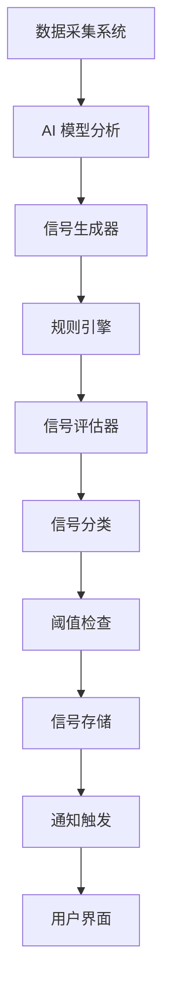

# 智能信号系统架构设计

## 1. 系统架构概述

智能信号系统是 TrendMatrix 项目的核心组件之一，负责基于多源数据和 AI 模型分析结果生成市场趋势信号，并提供给用户进行投资决策参考。

### 1.1 系统层次结构

```
┌─────────────────────────────────────────────────────────────────────────────┐
│                               用户层                                      │
├─────────────────────────────────────────────────────────────────────────────┤
│                          API 接口层                                       │
│ ┌──────────────┐ ┌──────────────┐ ┌──────────────┐ ┌──────────────┐         │
│ │ 信号查询 API │ │ 信号管理 API │ │ 通知设置 API │ │ 历史记录 API │         │
│ └──────────────┘ └──────────────┘ └──────────────┘ └──────────────┘         │
├─────────────────────────────────────────────────────────────────────────────┤
│                          业务逻辑层                                       │
│ ┌──────────────┐ ┌──────────────┐ ┌──────────────┐ ┌──────────────┐         │
│ │ 信号生成器   │ │ 规则引擎     │ │ 信号评估器   │ │ 通知系统     │         │
│ └──────────────┘ └──────────────┘ └──────────────┘ └──────────────┘         │
├─────────────────────────────────────────────────────────────────────────────┤
│                          数据处理层                                       │
│ ┌──────────────┐ ┌──────────────┐ ┌──────────────┐ ┌──────────────┐         │
│ │ 数据集成器   │ │ 信号分类器   │ │ 阈值管理器   │ │ 历史记录器   │         │
│ └──────────────┘ └──────────────┘ └──────────────┘ └──────────────┘         │
├─────────────────────────────────────────────────────────────────────────────┤
│                          数据存储层                                       │
│ ┌──────────────┐ ┌──────────────┐ ┌──────────────┐ ┌──────────────┐         │
│ │ 信号数据库   │ │ 规则配置库   │ │ 用户配置库   │ │ 历史统计库   │         │
│ └──────────────┘ └──────────────┘ └──────────────┘ └──────────────┘         │
├─────────────────────────────────────────────────────────────────────────────┤
│                         外部依赖层                                       │
│ ┌──────────────┐ ┌──────────────┐ ┌──────────────┐ ┌──────────────┐         │
│ │ AI 模型      │ │ 数据源       │ │ 消息服务     │ │ 第三方集成   │         │
│ └──────────────┘ └──────────────┘ └──────────────┘ └──────────────┘         │
└─────────────────────────────────────────────────────────────────────────────┘
```

## 2. 核心组件设计

### 2.1 信号生成器

**功能**：基于 AI 模型分析结果和市场数据生成信号

**实现方式**：
- 订阅 AI 模型分析结果
- 应用信号生成规则
- 计算信号强度和置信度
- 生成初始信号

**关键参数**：
- 信号类型（买入、卖出、持有、预警）
- 信号强度（1-10）
- 置信度（0-1）
- 触发条件
- 有效期

### 2.2 规则引擎

**功能**：管理和执行信号生成规则

**实现方式**：
- 规则配置和管理
- 规则执行和评估
- 规则优先级管理
- 规则冲突处理

**规则类型**：
- 阈值规则（基于数值阈值）
- 趋势规则（基于趋势分析）
- 组合规则（多个条件组合）
- 自定义规则（用户定义）

### 2.3 信号评估器

**功能**：评估信号的可靠性和质量

**实现方式**：
- 信号强度评估
- 置信度计算
- 历史准确率参考
- 多维度评估指标

**评估维度**：
- 技术指标一致性
- 基本面分析一致性
- 市场情绪一致性
- 历史信号准确率
- 时效性评估

### 2.4 通知系统

**功能**：向用户发送信号通知

**实现方式**：
- 通知配置管理
- 通知触发机制
- 多渠道通知（邮件、短信、推送）
- 通知模板管理

**通知类型**：
- 信号生成通知
- 信号更新通知
- 信号过期通知
- 重要信号提醒

### 2.5 历史记录器

**功能**：记录信号历史和准确率数据

**实现方式**：
- 信号历史存储
- 准确率计算
- 绩效分析
- 趋势分析

**数据结构**：
- 信号基本信息
- 触发条件
- 市场状态
- 后续价格走势
- 准确率计算

## 3. 数据流设计

### 3.1 信号生成流程



### 3.2 信号处理流程

1. **数据输入**：接收来自 AI 模型的分析结果（情感分析、价格预测、异常检测）
2. **信号生成**：应用规则引擎生成初始信号
3. **信号评估**：评估信号强度和置信度
4. **信号分类**：根据强度和类型对信号进行分类
5. **阈值检查**：与用户设置的阈值进行比较
6. **通知触发**：当信号达到阈值时触发通知
7. **历史记录**：存储信号历史和相关市场数据
8. **准确率计算**：基于后续市场走势计算信号准确率

## 4. 规则引擎设计

### 4.1 规则结构

```json
{
  "rule_id": "rule_001",
  "name": "比特币价格突破规则",
  "description": "当比特币价格突破 20 日均线且成交量增加 50% 时生成买入信号",
  "type": "trend",
  "conditions": [
    {
      "parameter": "price_ma_20",
      "operator": "cross_above",
      "value": "price_current"
    },
    {
      "parameter": "volume_change",
      "operator": "greater_than",
      "value": 0.5
    }
  ],
  "actions": [
    {
      "type": "generate_signal",
      "signal_type": "buy",
      "asset": "BTC",
      "strength": 8,
      "confidence": 0.7
    }
  ],
  "priority": 5,
  "enabled": true,
  "created_at": "2026-01-25T00:00:00Z",
  "updated_at": "2026-01-25T00:00:00Z"
}
```

### 4.2 规则执行机制

1. **规则匹配**：根据市场数据和 AI 分析结果匹配适用规则
2. **条件评估**：评估规则条件是否满足
3. **优先级处理**：按照优先级执行规则
4. **冲突解决**：处理规则冲突（如同时满足买入和卖出条件）
5. **动作执行**：执行规则定义的动作

### 4.3 规则类型

| 规则类型 | 描述 | 适用场景 | 示例 |
|---------|------|---------|------|
| 阈值规则 | 基于数值阈值生成信号 | 价格突破、成交量突变 | 价格突破 10000 美元时生成买入信号 |
| 趋势规则 | 基于趋势分析生成信号 | 趋势反转、动量变化 | 短期均线金叉长期均线时生成买入信号 |
| 组合规则 | 多个条件组合生成信号 | 多指标确认、复合信号 | 价格突破 + 成交量增加 + 情绪积极时生成强买入信号 |
| 异常规则 | 基于异常检测生成信号 | 市场异常、极端波动 | 价格波动超过历史 95% 范围时生成预警信号 |
| 模式规则 | 基于技术模式生成信号 | 图表模式、形态识别 | 头肩底形态完成时生成买入信号 |

## 5. 信号分类系统

### 5.1 信号级别

| 级别 | 强度范围 | 描述 | 推荐操作 |
|------|---------|------|----------|
| 极强 | 9-10 | 非常强烈的信号，多维度确认 | 强烈建议执行 |
| 强 | 7-8 | 强烈的信号，多个指标确认 | 建议执行 |
| 中等 | 5-6 | 中等强度的信号，有一定依据 | 考虑执行 |
| 弱 | 3-4 | 较弱的信号，依据有限 | 谨慎考虑 |
| 极弱 | 1-2 | 非常弱的信号，仅供参考 | 不建议执行 |

### 5.2 信号类型

| 类型 | 描述 | 示例 |
|------|------|------|
| 买入 | 建议买入的信号 | 价格突破阻力位，趋势向上 |
| 卖出 | 建议卖出的信号 | 价格跌破支撑位，趋势向下 |
| 持有 | 建议持有的信号 | 市场震荡，无明确趋势 |
| 预警 | 市场异常预警信号 | 成交量异常，价格波动剧烈 |
| 机会 | 潜在投资机会信号 | 价值低估，即将突破 |
| 风险 | 风险提示信号 | 市场泡沫，过度炒作 |

## 6. 技术实现方案

### 6.1 技术栈选择

- **后端**：Node.js / Python
- **数据库**：MongoDB (信号存储)、TimescaleDB (时间序列数据)
- **消息队列**：Redis / RabbitMQ (通知系统)
- **缓存**：Redis (信号缓存)
- **API**：RESTful API
- **通知**：Email、Webhook、Push Notification

### 6.2 关键模块实现

1. **信号生成器**
   - 基于事件驱动架构
   - 支持实时和批量处理
   - 可扩展的信号类型系统

2. **规则引擎**
   - 基于表达式的规则语言
   - 支持复杂条件组合
   - 规则优先级和冲突处理

3. **通知系统**
   - 多渠道通知集成
   - 可配置的通知模板
   - 通知频率控制

4. **历史记录系统**
   - 时序数据存储
   - 准确率计算算法
   - 绩效分析工具

### 6.3 性能优化策略

- **缓存策略**：热点信号和规则缓存
- **并行处理**：多信号并行生成和评估
- **异步处理**：通知和历史记录异步处理
- **索引优化**：数据库查询优化
- **批处理**：批量信号生成和更新

## 7. 扩展性设计

### 7.1 插件系统

- **规则插件**：自定义规则实现
- **通知插件**：自定义通知渠道
- **评估插件**：自定义评估指标
- **数据源插件**：自定义数据源集成

### 7.2 配置管理

- **规则配置**：可动态配置的规则
- **阈值配置**：用户可自定义的阈值
- **通知配置**：可自定义的通知设置
- **系统配置**：系统级别的配置参数

### 7.3 集成接口

- **AI 模型接口**：与 AI 模型的集成
- **数据采集接口**：与数据采集系统的集成
- **用户系统接口**：与用户系统的集成
- **第三方接口**：与第三方服务的集成

## 8. 安全性设计

### 8.1 数据安全

- **数据加密**：敏感数据加密存储
- **访问控制**：基于角色的访问控制
- **审计日志**：操作审计和日志
- **数据验证**：输入数据验证

### 8.2 系统安全

- **API 安全**：API 认证和授权
- **网络安全**：网络隔离和防护
- **依赖安全**：依赖库安全管理
- **漏洞扫描**：定期安全扫描

## 9. 部署与运维

### 9.1 部署架构

- **容器化部署**：Docker 容器
- **编排系统**：Kubernetes
- **弹性伸缩**：基于负载的自动伸缩
- **高可用性**：多节点部署

### 9.2 监控与告警

- **系统监控**：CPU、内存、磁盘监控
- **应用监控**：信号生成率、处理时间
- **业务监控**：信号准确率、用户满意度
- **告警机制**：异常情况告警

## 10. 总结

智能信号系统是 TrendMatrix 项目的核心组件，通过整合多源数据和 AI 模型分析结果，为用户提供准确、及时的市场趋势信号。系统采用模块化、可扩展的架构设计，支持多种信号类型和规则配置，能够适应不同用户的需求。

通过本文档的架构设计，智能信号系统将能够：

1. **准确生成**：基于多维度分析生成准确的市场信号
2. **及时通知**：通过多渠道及时通知用户重要信号
3. **智能评估**：评估信号强度和可靠性
4. **历史追踪**：记录信号历史和准确率
5. **灵活配置**：支持用户自定义规则和阈值

这些功能将为 TrendMatrix 用户提供强大的投资决策支持，帮助他们在复杂的加密货币市场中把握趋势，做出更明智的投资决策。
