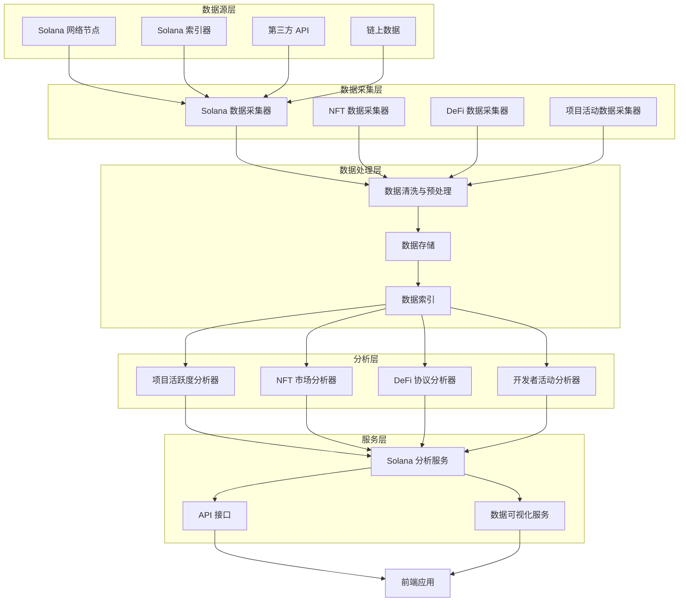

# Solana 生态分析架构设计

## 1. 系统架构

### 1.1 总体架构



### 1.2 核心组件

1. **数据采集层**
   - Solana 数据采集器：从 Solana 网络和索引器获取基础数据
   - NFT 数据采集器：专门采集 NFT 市场数据
   - DeFi 数据采集器：专门采集 DeFi 协议数据
   - 项目活动数据采集器：采集项目和开发者活动数据

2. **数据处理层**
   - 数据清洗与预处理：处理原始数据，去除噪声
   - 数据存储：存储处理后的数据
   - 数据索引：为快速查询建立索引

3. **分析层**
   - 项目活跃度分析器：分析项目的链上活动
   - NFT 市场分析器：分析 NFT 市场趋势
   - DeFi 协议分析器：分析 DeFi 协议的流动性和收益率
   - 开发者活动分析器：分析开发者的代码提交和贡献

4. **服务层**
   - Solana 分析服务：整合所有分析结果
   - API 接口：提供外部访问接口
   - 数据可视化服务：生成可视化图表和报告

## 2. 数据模型

### 2.1 项目数据模型

```python
class Project:
    project_id: str              # 项目唯一标识
    name: str                    # 项目名称
    symbol: str                  # 代币符号
    description: str             # 项目描述
    website: str                 # 项目网站
    twitter: str                 # Twitter 账号
    discord: str                 # Discord 链接
    telegram: str                # Telegram 链接
    github: str                  # GitHub 仓库
    launch_date: datetime        # 启动日期
    category: str                # 项目类别（DeFi、NFT、GameFi 等）
    status: str                  # 项目状态
    token_address: str           # 代币地址
    market_cap: float            # 市值
    circulating_supply: float    # 流通供应量
    total_supply: float          # 总供应量
    holders_count: int           # 持有者数量
```

### 2.2 项目活跃度数据模型

```python
class ProjectActivity:
    activity_id: str             # 活动唯一标识
    project_id: str              # 关联项目 ID
    timestamp: datetime          # 时间戳
    transaction_count: int       # 交易数量
    unique_addresses: int        # 唯一地址数量
    volume: float                # 交易量
    tvl: float                   # 总锁仓价值
    new_holders: int             # 新增持有者
    active_developers: int       # 活跃开发者数量
    code_commits: int            # 代码提交数量
    issue_resolutions: int       # 问题解决数量
    pull_requests: int           # PR 数量
    community_engagement: float  # 社区参与度
    sentiment_score: float       # 情感分数
```

### 2.3 NFT 市场数据模型

```python
class NFTCollection:
    collection_id: str           # 集合唯一标识
    name: str                    # 集合名称
    symbol: str                  # 集合符号
    description: str             # 集合描述
    image_url: str               # 集合图片
    floor_price: float           # 地板价
    volume_24h: float            # 24小时交易量
    volume_7d: float             # 7天交易量
    volume_30d: float            # 30天交易量
    sales_24h: int               # 24小时销售量
    sales_7d: int                # 7天销售量
    sales_30d: int               # 30天销售量
    average_price_24h: float     # 24小时平均价格
    average_price_7d: float      # 7天平均价格
    average_price_30d: float     # 30天平均价格
    owners: int                  # 持有者数量
    items: int                   # 项目数量
    market_cap: float            # 市值
    category: str                # 类别
    creator_royalty: float       # 创建者版税
    platform_fee: float          # 平台费用
    last_updated: datetime       # 最后更新时间
```

### 2.4 DeFi 协议数据模型

```python
class DeFiProtocol:
    protocol_id: str             # 协议唯一标识
    name: str                    # 协议名称
    symbol: str                  # 代币符号
    description: str             # 协议描述
    category: str                # 类别（DEX、借贷、收益聚合等）
    tvl: float                   # 总锁仓价值
    tvl_change_24h: float        # 24小时TVL变化
    tvl_change_7d: float         # 7天TVL变化
    tvl_change_30d: float        # 30天TVL变化
    volume_24h: float            # 24小时交易量
    volume_7d: float             # 7天交易量
    volume_30d: float            # 30天交易量
    fees_24h: float              # 24小时费用
    fees_7d: float               # 7天费用
    fees_30d: float              # 30天费用
    revenue_24h: float           # 24小时收入
    revenue_7d: float            # 7天收入
    revenue_30d: float           # 30天收入
    users_24h: int               # 24小时用户数
    users_7d: int                # 7天用户数
    users_30d: int               # 30天用户数
    token_price: float           # 代币价格
    token_price_change_24h: float # 24小时价格变化
    token_price_change_7d: float  # 7天价格变化
    token_price_change_30d: float # 30天价格变化
    risk_score: float            # 风险评分
    last_updated: datetime       # 最后更新时间
```

### 2.5 开发者活动数据模型

```python
class DeveloperActivity:
    developer_id: str            # 开发者唯一标识
    name: str                    # 开发者名称
    username: str                # 用户名
    avatar_url: str              # 头像 URL
    total_commits: int           # 总提交数
    total_repositories: int      # 总仓库数
    total_contributions: int     # 总贡献数
    active_projects: int         # 活跃项目数
    followers: int               # 关注者数量
    repositories: list           # 仓库列表
    recent_commits: list         # 最近提交
    skills: list                 # 技能列表
    last_active: datetime        # 最后活跃时间
    average_commit_frequency: float # 平均提交频率
```

## 2. 数据采集与处理

### 2.1 数据源

1. **Solana 网络节点**
   - 通过 RPC API 获取链上数据
   - 支持实时数据和历史数据查询

2. **Solana 索引器**
   - 使用第三方索引器如 Flipside Crypto、Dune Analytics
   - 提供更高效的数据查询能力

3. **第三方 API**
   - NFT 市场 API：Magic Eden、OpenSea、Solana NFT
   - DeFi 协议 API：DefiLlama、SolanaFM
   - 开发者数据 API：GitHub API

4. **链上数据**
   - 交易数据
   - 智能合约交互数据
   - 代币转移数据
   - NFT 交易数据
   - DeFi 协议交互数据

### 2.2 数据采集策略

1. **实时采集**
   - 关键指标的实时监控
   - 高频数据的采集

2. **定期采集**
   - 按小时、日、周、月的周期采集
   - 适用于趋势分析的数据

3. **批量采集**
   - 历史数据的批量导入
   - 大规模数据的处理

### 2.3 数据处理流程

1. **数据清洗**
   - 去除噪声数据
   - 处理缺失值
   - 标准化数据格式

2. **数据预处理**
   - 数据转换
   - 特征工程
   - 数据聚合

3. **数据存储**
   - 时序数据库存储时间序列数据
   - 关系型数据库存储结构化数据
   - 文档数据库存储半结构化数据

4. **数据索引**
   - 为快速查询建立索引
   - 优化数据检索性能

## 3. 分析功能

### 3.1 项目活跃度分析

1. **核心指标**
   - 交易量和交易频率
   - 活跃地址数量
   - 新增用户数量
   - 锁仓价值变化
   - 开发者活动
   - 社区参与度

2. **分析方法**
   - 时间序列分析
   - 趋势识别
   - 异常检测
   - 相关性分析

3. **输出结果**
   - 项目活跃度评分
   - 活跃度趋势图表
   - 异常活动警报
   - 项目健康状况评估

### 3.2 NFT 市场分析

1. **核心指标**
   - 地板价变化
   - 交易量和交易频率
   - 平均价格
   - 持有者分布
   - 销售数量
   - 市场份额

2. **分析方法**
   - 市场趋势分析
   - 价格预测
   - 流动性分析
   - 市场情绪分析

3. **输出结果**
   - NFT 市场趋势报告
   - 集合表现排名
   - 价格预测模型
   - 投资机会识别

### 3.3 DeFi 协议分析

1. **核心指标**
   - 总锁仓价值 (TVL)
   - 交易量
   - 费用和收入
   - 用户数量
   - 收益率
   - 风险指标

2. **分析方法**
   - 协议性能评估
   - 风险分析
   - 收益率比较
   - 流动性分析

3. **输出结果**
   - DeFi 协议排名
   - 风险评估报告
   - 收益率分析
   - 投资策略建议

### 3.4 开发者活动分析

1. **核心指标**
   - 代码提交频率
   - 代码质量
   - 问题解决速度
   - PR 数量和质量
   - 文档完善度
   - 技术栈多样性

2. **分析方法**
   - 开发者活跃度评估
   - 代码质量分析
   - 团队协作分析
   - 技术趋势识别

3. **输出结果**
   - 开发者活跃度排名
   - 项目技术健康度
   - 开发进度跟踪
   - 技术风险评估

## 4. 服务与 API

### 4.1 Solana 分析服务

1. **核心功能**
   - 项目活跃度分析
   - NFT 市场分析
   - DeFi 协议分析
   - 开发者活动分析
   - 数据聚合与可视化

2. **服务接口**
   - 项目分析接口
   - NFT 分析接口
   - DeFi 分析接口
   - 开发者分析接口
   - 综合分析接口

### 4.2 API 接口

1. **RESTful API**
   - 项目数据接口
   - NFT 市场数据接口
   - DeFi 协议数据接口
   - 开发者数据接口
   - 分析结果接口

2. **WebSocket API**
   - 实时数据推送
   - 市场变化通知
   - 异常活动警报

3. **GraphQL API**
   - 灵活的数据查询
   - 多维度数据聚合
   - 高效的数据获取

### 4.3 数据可视化服务

1. **可视化类型**
   - 趋势图表
   - 热力图
   - 雷达图
   - 散点图
   - 仪表盘

2. **交互功能**
   - 时间范围选择
   - 数据筛选
   - 图表交互
   - 数据导出

3. **响应式设计**
   - 桌面端适配
   - 移动端适配
   - 平板端适配

## 5. 技术选型

### 5.1 后端技术

1. **编程语言**
   - Python：数据分析和机器学习
   - Node.js：API 服务和实时数据处理

2. **框架**
   - FastAPI：高性能 API 服务
   - Express.js：轻量级 API 服务
   - Pandas：数据处理
   - NumPy：数值计算
   - Scikit-learn：机器学习

3. **数据库**
   - TimescaleDB：时序数据存储
   - MongoDB：半结构化数据存储
   - PostgreSQL：结构化数据存储

4. **缓存**
   - Redis：数据缓存和会话管理

5. **消息队列**
   - Kafka：实时数据处理
   - RabbitMQ：任务队列

### 5.2 前端技术

1. **框架**
   - Vue 3：响应式前端框架
   - React：组件化前端框架

2. **数据可视化**
   - D3.js：自定义可视化
   - ECharts：丰富的图表库
   - Chart.js：轻量级图表库

3. **状态管理**
   - Pinia：Vue 3 状态管理
   - Redux：React 状态管理

4. **样式**
   - Tailwind CSS：实用优先的 CSS 框架
   - Ant Design：企业级 UI 组件库

### 5.3 基础设施

1. **云服务**
   - AWS：弹性云服务
   - GCP：全球覆盖
   - Azure：企业级服务

2. **容器化**
   - Docker：应用容器化
   - Kubernetes：容器编排

3. **CI/CD**
   - GitHub Actions：自动化工作流
   - Jenkins：持续集成

4. **监控**
   - Prometheus：监控系统
   - Grafana：数据可视化

## 6. 集成与部署

### 6.1 系统集成

1. **与主系统集成**
   - API 集成
   - 数据集成
   - 认证集成

2. **与其他模块集成**
   - 与智能信号系统集成
   - 与 AI 分析模块集成
   - 与数据采集模块集成

### 6.2 部署策略

1. **容器化部署**
   - 使用 Docker 容器
   - Kubernetes 编排

2. **微服务架构**
   - 服务拆分
   - 独立部署
   - 弹性伸缩

3. **数据同步策略**
   - 实时同步
   - 定期同步
   - 批量同步

### 6.3 安全考虑

1. **数据安全**
   - 数据加密
   - 访问控制
   - 数据脱敏

2. **API 安全**
   - API 密钥认证
   - 请求限流
   - 恶意请求检测

3. **系统安全**
   - 漏洞扫描
   - 安全审计
   - 入侵检测

## 7. 性能优化

### 7.1 数据处理优化

1. **并行处理**
   - 多线程处理
   - 分布式计算

2. **缓存策略**
   - 多级缓存
   - 智能缓存失效

3. **查询优化**
   - 索引优化
   - 查询计划优化

### 7.2 服务优化

1. **API 性能**
   - 响应时间优化
   - 吞吐量提升

2. **资源利用**
   - CPU 利用率优化
   - 内存使用优化

3. **扩展性**
   - 水平扩展
   - 垂直扩展

## 8. 监控与维护

### 8.1 系统监控

1. **健康检查**
   - 服务状态监控
   - 数据库状态监控

2. **性能监控**
   - 响应时间监控
   - 资源使用监控

3. **错误监控**
   - 异常检测
   - 错误日志分析

### 8.2 数据质量监控

1. **数据完整性**
   - 数据缺失检测
   - 数据一致性检查

2. **数据准确性**
   - 数据验证
   - 数据校准

3. **数据及时性**
   - 数据更新监控
   - 数据延迟检测

### 8.3 维护策略

1. **定期维护**
   - 数据库优化
   - 日志清理

2. **故障恢复**
   - 备份策略
   - 恢复计划

3. **升级策略**
   - 平滑升级
   - 回滚机制

## 9. 结论

Solana 生态分析系统是一个复杂的、多层次的系统，需要整合多源数据，提供深度分析功能，并以直观的方式呈现结果。通过合理的架构设计、高效的数据处理、先进的分析方法和良好的技术选型，该系统可以为用户提供有价值的 Solana 生态洞察，帮助用户做出更明智的投资决策。

系统的成功实施需要团队协作、持续优化和不断改进，以适应 Solana 生态的快速发展和变化。
